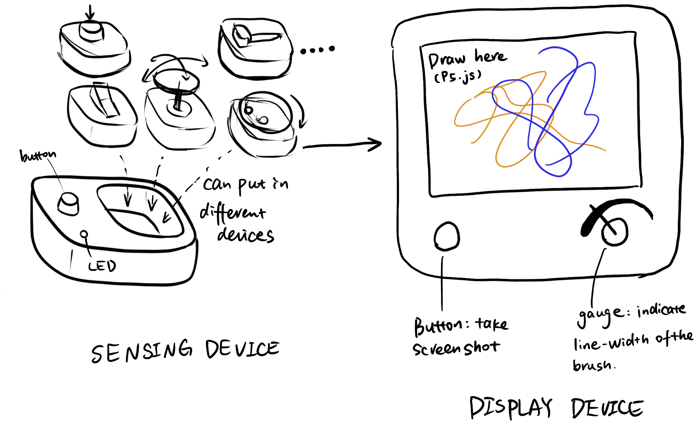

# MagDocker: a modular and customizable tangible inputs interface 
## Overview
**One sentence explanation**: A device that can read inputs from various customized (supports user DIY) tangible interfaces to control applications on computers.

**Potential applications**: software extension inputs (e.g. shortcuts in PS, AI, figma), music controllers (e.g. volume, mix controls), tailored game controllers (e.g. joysticks)…

**Details**: In this project, since I need to build two separate devices (which means I cannot directly plug this sensing device into my laptop), I decide to make this device an extension of the raspberry pi (um... also a computer, but more "device"-like. I think it's good enough for function demonstrations). For the application to be controlled, I want to use P5.js, which is a client-side JS platform for creative coding. The data transmitted from the sensing device will go into this web application for creative plotting (drawing).

**Highlights**
- The sensing device on the left consists of a "Docker" that has up to four available slots for different inputs, and a variety of different tangible inputs, including buttons, switches, joysticks, rotary encoders, sliders, etc. Users can put different inputs into the Docker to customize their input combination.
    - An additional physical button is implemented on the sensing device to achieve synchronized actions along with other modular inputs. For example, I can use a joystick module to control the position of the brush, while use this button to "drop off" the brush and start to paint.
- The display device is a "drawing canvas" developed using P5.js, where users can use the configured tangible inputs to draw on the blank canvas. For example, the joystick can be used to move the brush around, the switch can be used to clear the canvas, the rotaty encoder can be used to choose different artistic line styles or colors, the slider can be used to adjust the line width of the stroke, etc.
- The button on the display is used to capture the screen (make a screenshot of the artwork you created), and the stepper motor driven gauge is used to indicate current line width in real time.

## Sensor Device
### BOM
- 1 * [TLV493D magnetometer](https://www.digikey.com/en/products/detail/infineon-technologies/TLV493DA1B6HTSA2/5891933?utm_adgroup=&utm_source=google&utm_medium=cpc&utm_campaign=PMax%20Shopping_Product_High%20ROAS%20Categories&utm_term=&utm_content=&gad_source=1&gclid=Cj0KCQiAwbitBhDIARIsABfFYIIhFqM7H84WtRHeHdwaDSvtmzkl_We-hbJ-xpQ3_GwyePpydjeioHoaAnVZEALw_wcB)
- 1 * [XIAO ESP32S3/ESP32C3](https://www.seeedstudio.com/XIAO-ESP32S3-p-5627.html)
- 1 * Button
- 1 * LED

### Explanation
The sensor device features the same sensor for configuring diverse inputs from different input devices. The magic here is that I can use a **3 axis hall effect sensor (or, magnetometer)** (I plan to use [TLV493D](https://www.digikey.com/en/products/detail/infineon-technologies/TLV493DA1B6HTSA2/5891933?utm_adgroup=&utm_source=google&utm_medium=cpc&utm_campaign=PMax%20Shopping_Product_High%20ROAS%20Categories&utm_term=&utm_content=&gad_source=1&gclid=Cj0KCQiAwbitBhDIARIsABfFYIIhFqM7H84WtRHeHdwaDSvtmzkl_We-hbJ-xpQ3_GwyePpydjeioHoaAnVZEALw_wcB), which can sense the magnetic field in three different axis. With embedded magnets in different input devices and simple DSP or ML, this magnetic field change signal can be translated back to physical movements of the tangible input. 

<!-- Since I have four slots for input modules, I need four separate magnetometers. The TLV493D breakout board I plan to use does not support this many I2C addresses. Therefore, I also plan to use [PCA9546 4-Channel I2C Multiplexer](https://www.adafruit.com/product/5663?gad_source=1&gclid=CjwKCAiA44OtBhAOEiwAj4gpOQNsuiN8hg1QvpYTfDjro9lVUyD4wOL_vgsaaYoJqwa46neCTyKjBBoCxAYQAvD_BwE) to wire all the four sensors to the same SCL and SDA pins of the microcontroller.
 -->

For the microcontroller, I plan to build Bluetooth communication between the sensing and display device, so ESP32 series are my top choices (e.g. [ESP32C3](https://www.seeedstudio.com/Seeed-XIAO-ESP32C3-p-5431.html) or [ESP32S3](https://www.seeedstudio.com/XIAO-ESP32S3-p-5627.html)).

## Display Device
### BOM
- 1 * [Raspberry Pi 4](https://www.raspberrypi.com/products/raspberry-pi-4-model-b/)
- 1 * [Raspberry Pi Display](https://www.amazon.com/dp/B097H277WS?ref_=cm_sw_r_apin_dp_H4QJ45A799ZPF6NZQ4QH&language=en-US&th=1)
- 1 * [Stepper motor gauge](https://www.adafruit.com/product/2424)
- 1 * [TB6612 Stepper Motor Driver Breakout Board](https://www.adafruit.com/product/2448)
- 1 * Button

### Explanation
The display device is built around the Raspberry Pi. It runs a Python program and a P5.js program. The Python reads inputs from a button (capture screenshot) and controls the x27 stepper motor via the TB6612 breakout board (with H-bridge). The needle of the motor indicates the current stroke width of the brush. A 7 inch LCD display is plugged to the Raspberry Pi using HDMI cable to show the canvas of the P5.js. An LED is used to indicate if there are changes since the last screenshot.

## Communication between Devices
The ESP32C3 and ESP32S3 both support BLE and WiFi communication. Considering the energy consumption, BLE is obviously a better solution.
- Option 1: build BLE communication between both the backend (Python program) and the frontend (P5.js, using Web BLE). This is basically connect a BLE server to two clients. The Web BLE uses data to draw plots using P5.js, and the Python uses data to drive motor accordingly. The data is processed on ESP32 device.
- Option 2: build BLE communication only between the sensing device and the back-end Python script. Raw data is send, and Python process the raw data into movement data. The communication between the frond-end and back-end is established by building a Python Flask server, and P5.js send GET request to the server to get data updates.

## Schematic diagram of the system
### Sensing device

### Display device
