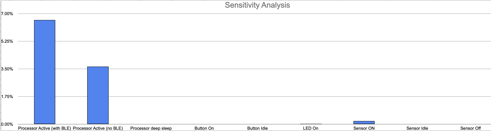

# MagDock: a modular and customizable tangible inputs interface 

# OVERVIEW

## One Sentence Explanation
A customizable and reconfigurable haptic modular input interface for computers.

## Problem being Solved
Interacting with computers nowadays, either via touchscreens or keyboards (which are basically all buttons) is __BORING__!

The vision is to develop a new input interface, which supports rich interaction inputs and can be configured to be used in various scenarios to boost user experience, promote working efficiency, spark creative expression, enable precise input, provide interesting haptic feedback, etc.

## The Proposed Solution

The input device consists of two parts: a base (left) and various tactile input components (right). To use, simply snap one input component onto the __receptor__ of the base, which can automatically identify the component and read real-time inputs from it.

This input device can be directly used with laptops, pads, phones, etc. But to meet the requirements for the TECHIN514 course, I made a mockup of the computer using Raspberry Pi. To demonstrate the input potentials, I used a drawing web app (using P5.js on the browser of the Raspberry Pi) as a demonstration to showcase the potential of my design in supporting creative expressions (To be more specific, the joystick component is used to move the brush, the slider to adjust the width of the brush, the rotary knob to change the brush color, and the switch to clear the canvas). 

This is just a glimpse of the application! __Other **potential applications** include software extension inputs (e.g. shortcuts in PS, AI, Figma), music controllers/synthesizers (e.g. volume, mix controls), tailored game controllers (e.g. joysticks), sleek controllers for your next robot, etc.

## Working Video
[https://youtu.be/ztausAnTfQE](https://youtu.be/ztausAnTfQE)

# SYSTEM ARCHITECTURE
Details on the sensor device and the display device be elaborated in later sections. This is an overview of how the system architecture looks like:

## Highlights
- _Digital signal processing algorithms_ (explained in the "SENSOR DEVICE" section) are implemented on the ESP32S3 to convert 3-axis magnetic field data to interaction data.
- _BLE communication_ is used between the ESP32S3 XIAO and Raspberry Pi 4B to send real-time interaction data.
- _Websocket communication_ is used to realize real-time bidirectional data communication between the front-end app and the backend Python server.

# SENSOR DEVICE
## BOM
- 1 * [TLV493D magnetometer](https://www.digikey.com/en/products/detail/infineon-technologies/TLV493DA1B6HTSA2/5891933?utm_adgroup=&utm_source=google&utm_medium=cpc&utm_campaign=PMax%20Shopping_Product_High%20ROAS%20Categories&utm_term=&utm_content=&gad_source=1&gclid=Cj0KCQiAwbitBhDIARIsABfFYIIhFqM7H84WtRHeHdwaDSvtmzkl_We-hbJ-xpQ3_GwyePpydjeioHoaAnVZEALw_wcB)
- 1 * [XIAO ESP32S3](https://www.seeedstudio.com/XIAO-ESP32S3-p-5627.html)
- 1 * [2000mAh Lipo battery](https://www.amazon.com/EEMB-2000mAh-Battery-Rechargeable-Connector/dp/B08214DJLJ/ref=sr_1_1?dib=eyJ2IjoiMSJ9.AaRESnG2KaFKBm4vGoJVULr2WB7qFfzYabhQ8Md9-b0vouJRAb8AD5igu6PWXLmkuJEBYbmRwImuKpHJ5pdsRhLyEwjjvQsChCuQ9Ti5hnj9xJeLnhLysFlpADGO_9WMmdDrR2XryqkDcmluJ8wsNDxWuVySQLAJO6v03Y8syoecPRel8-V4ZoHsAkFCZxQORCnmBdP4aBUzIJObcNZi49DLOO0gj_rjCUnFOWYI9McB_vaOh1NP30QFY3F0BmUPpnUr-lxkKe98RbT2v33ip_LxNOVFw7DFMRtKO3Jb8u4.rOgeP4vU8pEIH39cHDtfo4-2HcSZcZEHqHCOB0A5jKM&dib_tag=se&keywords=2000mah+lipo&qid=1709613646&sr=8-1-spons&sp_csd=d2lkZ2V0TmFtZT1zcF9hdGY&psc=1), 1 * [JST-PH 2-Pin SMT Right Angle Connector](https://www.adafruit.com/product/1769?gad_source=1&gclid=CjwKCAiA_5WvBhBAEiwAZtCU75R4XCVwLk1HYnA0MNp8xvJQ45ZHca9OrB8anyndbpKNvk83ktt8_hoCJtcQAvD_BwE) 
- 1 * [Button](https://www.amazon.com/Adafruit-Tactile-Switch-Buttons-square/dp/B00NAY37SK/ref=asc_df_B00NAY37SK/?tag=hyprod-20&linkCode=df0&hvadid=642070594779&hvpos=&hvnetw=g&hvrand=4309338619546982171&hvpone=&hvptwo=&hvqmt=&hvdev=c&hvdvcmdl=&hvlocint=&hvlocphy=9033254&hvtargid=pla-1951385054385&psc=1&mcid=a067f44c1c923892b17863cb8308e844), 1 * [Switch](https://www.digikey.com/en/products/detail/c&k/OS102011MA1QS1/1981431?utm_adgroup=&utm_source=google&utm_medium=cpc&utm_campaign=PMax%20Shopping_Product_Low%20ROAS%20Categories&utm_term=&utm_content=&utm_id=go_cmp-20243063506_adg-_ad-__dev-c_ext-_prd-1981431_sig-CjwKCAiAkp6tBhB5EiwANTCx1A7sPpbNQ89EW0h3bJgkv2yNfTDiOd1HKm84Rqtennji4eYTwqsnyBoCj2gQAvD_BwE&gad_source=1&gclid=CjwKCAiAkp6tBhB5EiwANTCx1A7sPpbNQ89EW0h3bJgkv2yNfTDiOd1HKm84Rqtennji4eYTwqsnyBoCj2gQAvD_BwE)
- 1 * [LS R976 SMD LED](https://www.digikey.com/en/products/detail/ams-osram-usa-inc./LS%2520R976-NR-1-0-20-R18/1642798?utm_adgroup=&utm_source=google&utm_medium=cpc&utm_campaign=PMax%20Shopping_Product_Medium%20ROAS%20Categories&utm_term=&utm_content=&utm_id=go_cmp-20223376311_adg-_ad-__dev-c_ext-_prd-1642798_sig-CjwKCAiA_5WvBhBAEiwAZtCU73qnJ3SjxQmnfvGEfz_Vjte8sVrvr7AMyYXotjacGVyFfUPCos_6uxoCeiEQAvD_BwE&gad_source=1&gclid=CjwKCAiA_5WvBhBAEiwAZtCU73qnJ3SjxQmnfvGEfz_Vjte8sVrvr7AMyYXotjacGVyFfUPCos_6uxoCeiEQAvD_BwE)
- SMD resistors and capacitors
- Magnets (8mm and 3mm)
- 5mm Acrylic sheet for enclosure
## Schematic Diagram

## Gallery

## Details
### 🧲 🧲 ❤️ it's all about magnets ❤️ 🧲 🧲
Magnets, magnets, magnets, magnets! Hooray!
In this project, magnets are without doubt the protagonist! It's used as:
- Providing __haptic feedback__ on the input components (inspired by [Mechamagnets](https://clementzheng.info/Mechamagnets)).
- Providing the __snapping force__ between the input components and the sensor base.
- Serving as the __conductor__. As shown in the image, each input component has a resistor embedded in it - it's a cheap and simple alternative to NFC tags - __it allows the sensor device to identify which component is attached to the base__. The resistor is snap to the magnet, which in turn snap to the screws fixed on the main PCB, thus forming a conductive path. Then, a simple voltage divider circuit is enough to let the MCU recognize different input components.
- Serving as the __input trigger__: when users interact with the inputs, the position of certain embedded magnets will change, enabling the 3-axis hall effect sensor to track its interaction state.

### DSP to convert 3-axis magnetic field data to interaction data

Each input component has three kinds of magnets:
- Haptic feedback provider.
- "Snapper" to base.
- Input trigger.

The input trigger moves along with the moving part of the input component, causing the magnetic field to change:

Yes.. but how to interpret the raw three-axis magnetic field data?

- Firstly the raw data goes through a moving average filter.
- Then, for discrete inputs (including _slider_, _rotary knob_, and _toggle switch_), I documented the average reading of the TLV493D sensor with the input component's moving part in different positions. Then, given a new reading from the sensor, the algorithm will find the shortest Euclidean distance between the new vector and pre-collected vectors in the dataset, thus identifying the moving part's position. This algorithm is inspired by the RAG method (the vector in this case is text embeddings) in the LLM.
- For continuous inputs (the _joystick_), I documented the sensor reading with the joystick pointing in different directions. The results were typical sinusoidal functions in the x and y direction (the Bx and By are used to configure the direction of the joystick, while the Bz is used to identify whether the joystick is moved away from the center point). Therefore, given a By and Bx value, I can first compare the Bx with the baseline to tell whether it's in [0, pi] or [pi, 2pi], then by calculating `arccos(By)`, I can get the solution of the angle of the joystick.

In conclusion, this sensor device features a single sensor for configuring diverse inputs from different input devices.

# DISPLAY DEVICE
## BOM
- 1 * [Raspberry Pi 4B](https://www.raspberrypi.com/products/raspberry-pi-4-model-b/)
- 1 * [7inch Display](https://www.amazon.com/dp/B097H277WS?ref_=cm_sw_r_apin_dp_H4QJ45A799ZPF6NZQ4QH&language=en-US&th=1)
- 1 * [Stepper motor gauge](https://www.adafruit.com/product/2424)
- 1 * Button
- 1 * LED
- Several JST connectors
- 1.5mm Acrylic sheet for enclosure

## Schematic Diagram

## Gallery

## Details
The display device is built around the Raspberry Pi. It runs a Python backend and a frontend using P5.js. The Python reads inputs from a button (capture screenshot) and controls the x27 stepper motor directly via four GPIOs (which is not safe to do so, but the x27 stepper motor consumes little current and is safe to drive using mere GPIOs on the Raspberry Pi. Otherwise H-Bridge should be used, such as the TB6612 IC). The needle of the motor indicates the current stroke width of the brush. A 7-inch LCD display is plugged into the Raspberry Pi using an HDMI cable to show the canvas of the P5.js. An LED is used to indicate if the button is pressed and a screenshot is captured.

# BATTERY CONSIDERATIONS
## Sensor Device

### usage modes
- __Sleep: if the sensor detects no reading change for 5 min, switch to sleep mode. In this mode, 20% of the time will be used to be Active without BLE (to detect whether there is a reading change); and 80% of the time will be in deep sleep.
- __Sensing__: active sensing mode, collect sensor data and send data to display device via BLE. In this mode, the MCU would always be active with BLE to guarantee a fluent user experience.
### reflections
- As a peripheral device of computers like keyboards and mice, I want my device can be used for around a week without charging. So I determine my "days of use" metric based on my application scenario.
- Any battery size under 10cm * 5cm is acceptable since my device is something you would put on the table for a long time, but not carry with you a lot. I also made the size of my sensing device relatively large because in this way users can better interact with those tangible inputs, allowing it to provide a better hand feel.
- The battery tradeoff: although the battery size can be relatively large, the major consideration would be the cost (larger battery capacity, more expensive). So the first tradeoff I made would be to choose a 2000mAh Lipo battery, which balances cost and battery capacity. 
- Other potential tradeoffs can be: when the data transfer rate is low, the power consumption will be low as well, but in my application case, it’ll cause a negative user experience, which can be an important tradeoff.
- After analyzing my power, I learned that both the processor and sensor can run on very low energy consumption modes (some sensors provide low power modes as well). These features can be used to optimize power consumption. 

## Display Device

### usage modes
- __Idle mode__: not receiving data from the processor for 5 minutes, idle the Pi and disable HDMI (turn the screen off) to save power
    - Raspberry Pi itself doesn’t have a low power/sleep mode and requires extra hardware https://spellfoundry.com/sleepy-pi/sleepy-pi-faq/
- __Interactive mode__: perform intended drawing functionalities (receive sensor data, plot graph via p5.js, and other interactive inputs/outputs: e.g. LED, button, and stepper motor).

### reflections
- After analyzing, I found that Raspberry Pi consumes TONS of power, and it is also very picky on the power supply: the Pi4B requires a good quality USB-C power supply capable of delivering 5V at 3A https://github.com/YueChengPeng/MagDocker/blob/main/datasheet/raspberry-pi-4-datasheet.pdf. I found no Lipo battery or power bank that can supply a current this large. Therefore, it’s better to power it directly via USB-C power cables but not batteries. A good display also consumes a lot of power. Given that, the "days of use" will be "forever" as long as you have the power plugged in.

- The usage of power cables is a good tradeoff considering user experience.
    - _Cost_: large-capacity batteries (even imagine there does exist one that supports 3A output) are obviously more expensive than a simple USB-C charger.
    - _Portability_: small size (lightweight) and large capacity (work longer) obviously cannot be achieved at the same time. If we want the Pi to work longer, the battery size will hinder better portability. But with the USB-C charger, this will be a non-issue.

# BUDGET SUMMARY
| Sensor Device Components                 | Price | Number | Total Price |
|------------------------------------------|-------|--------|-------------|
| XIAO ESP32S3                             | 7.49  | 1      | 7.49        |
| 2000mAh Lipo battery                     | 13.99 | 1      | 13.99       |
| Button                                   | 0.5   | 1      | 0.5         |
| Switch                                   | 0.64  | 1      | 0.64        |
| SMD LED                                  | 0.27  | 1      | 0.27        |
| TLV493DA1B6HTSA2                         | 1.5   | 1      | 1.5         |
| JST-PH 2-Pin SMT Right Angle Connector   | 0.75  | 1      | 0.75        |
| Acrylic enclosure                        | 18.99 | 1      | 18.99       |
| Magnets (8mm and 3mm)                    | 12    | 1      | 12          |
| Resistors & Capacitors                   | 0.5   | 1      | 0.5         |
| **Sum**                                  |       |        | **56.63**   |

| Display Device Components                | Price | Number | Total Price |
|------------------------------------------|-------|--------|-------------|
| Raspberry Pi 4B                          | 35    | 1      | 35          |
| stepper motor                            | 5     | 1      | 5           |
| Button                                   | 0.5   | 1      | 0.5         |
| LED                                      | 0.4   | 1      | 0.4         |
| JST connectors                           | 1     | 1      | 1           |
| 7inch display                            | 45.99 | 1      | 45.99       |
| Acrylic enclosure                        | 5     | 1      | 5           |
| **Sum**                                  |       |        | **92.89**   |

| **Total Sum**                            | 149.52    |
|------------------------------------------|-----------|
| **Total Sum Purchased by GIX**           | 97.32     |

# FUTURE WORKS
- Enrich the tangible input components library.
- Change the component identification mechanism: maybe small NFC tags are strong substitutions.
- Increase receptors of the sensor base! Originally I envisioned something like the dock on the IOS/MacOS that consisted of a long receptor of many icons (components, in my case). Due to the time limit, I could only implement a version with only one receptor. It will definitely be interesting to have a, e.g. four receptor base, where users can configure different combinations of components under different work scenarios.
- Fully open source my design and provide more detailed steps to replicate this work. Also include a user guide on how to design the user's tangible inputs (e.g. the middle "haptic" layer of the input components can be changed on the fly to configure different haptic feedback).
- Implement a driver software, so that this input interface can be used on software on my computer. In the software, users can dynamically reconfigure the DSP algorithm for their customized components.